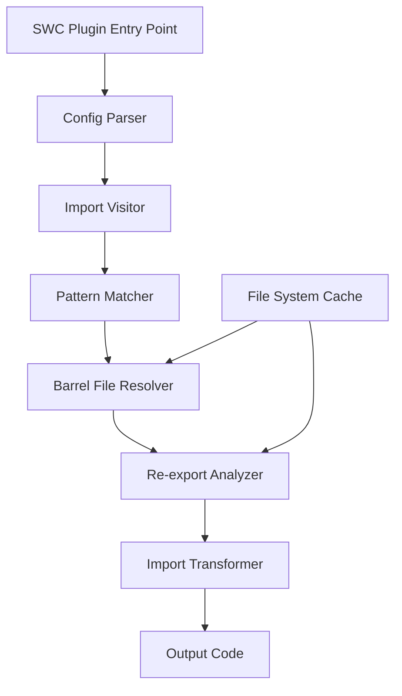

# Detailed Implementation Plan for SWC Barrel Files Plugin

## 1. Overview

The plugin will optimize imports from barrel files (index.ts files that re-export from other files) by replacing them with direct imports to the original source files. This will improve both performance and bundle size by eliminating the indirection that barrel files create, which can prevent proper tree-shaking.

## 2. Core Requirements

The plugin must:

1. Optimize only imports from absolute paths and package entry points
2. Use a configuration to define patterns that need optimization
3. Validate that barrel files contain only re-exports (no other code)
4. Resolve imports to their original source files
5. Handle special cases like renamed identifiers
6. Throw an error when a barrel file contains non-re-export code
7. Do nothing when no rules are provided
8. Require explicit configuration of path aliases

## 3. Plugin Architecture



## 4. Implementation Steps

### 4.1. Plugin Configuration Structure

We'll implement a configuration structure that allows specifying:

```rust
#[derive(Deserialize, Debug)]
pub struct Config {
    // Rules for pattern matching (optional)
    rules: Option<Vec<Rule>>,
}

#[derive(Deserialize, Debug)]
pub struct Rule {
    // Pattern to match (e.g., '#entities/*')
    pattern: String,

    // Possible paths to resolve (e.g., ['src/entities/*/index.ts'])
    paths: Vec<String>,
}
```

### 4.2. Import Visitor

Implement a visitor that traverses the AST and identifies import declarations:

```rust
impl VisitMut for BarrelTransformVisitor {
    fn visit_mut_import_decl(&mut self, import_decl: &mut ImportDecl) {
        // If no rules are provided, do nothing
        if self.config.rules.is_none() {
            return;
        }

        // Check if the import source matches any of our patterns
        if let Some(rule) = self.match_pattern(&import_decl.src.value) {
            // Process the import based on the matched rule
            self.process_import(import_decl, rule);
        }

        // Continue traversing
        import_decl.visit_mut_children_with(self);
    }
}
```

### 4.3. Pattern Matcher

Implement a pattern matcher that checks if an import path matches any of the configured patterns:

```rust
impl BarrelTransformVisitor {
    fn match_pattern(&self, import_path: &str) -> Option<&Rule> {
        // If no rules are provided, return None
        let rules = match &self.config.rules {
            Some(rules) => rules,
            None => return None,
        };

        // Check if the import path matches any custom patterns
        for rule in rules {
            if self.path_matches_pattern(import_path, &rule.pattern) {
                return Some(rule);
            }
        }

        None
    }

    fn path_matches_pattern(&self, path: &str, pattern: &str) -> bool {
        // Implement pattern matching logic
        // Support wildcards and other pattern features

        // Convert pattern to regex
        let regex_pattern = pattern
            .replace("*", "([^/]+)")
            .replace(".", "\\.")
            .replace("/", "\\/");

        let regex = Regex::new(&format!("^{}$", regex_pattern)).unwrap();

        regex.is_match(path)
    }
}
```

### 4.4. Barrel File Resolver

Implement a resolver that locates the actual barrel file based on the pattern and configured paths:

```rust
impl BarrelTransformVisitor {
    fn resolve_barrel_file(&self, import_path: &str, rule: &Rule) -> Option<String> {
        // Extract components from the import path based on the pattern
        let components = self.extract_pattern_components(import_path, &rule.pattern);

        // Try each possible path template
        for path_template in &rule.paths {
            let resolved_path = self.apply_components_to_template(path_template, &components);

            // Check if the file exists
            if self.file_exists(&resolved_path) {
                return Some(resolved_path);
            }
        }

        None
    }

    fn extract_pattern_components(&self, path: &str, pattern: &str) -> HashMap<String, String> {
        let mut components = HashMap::new();

        // Convert pattern to regex with named capture groups
        let mut regex_pattern = String::new();
        let mut i = 0;

        for part in pattern.split('*') {
            regex_pattern.push_str(&regex::escape(part));

            if i < pattern.split('*').count() - 1 {
                regex_pattern.push_str(&format!("(?P<p{}>.*?)", i));
                i += 1;
            }
        }

        let regex = Regex::new(&format!("^{}$", regex_pattern)).unwrap();

        if let Some(captures) = regex.captures(path) {
            for i in 0..i {
                let name = format!("p{}", i);
                if let Some(capture) = captures.name(&name) {
                    components.insert(name, capture.as_str().to_string());
                }
            }
        }

        components
    }

    fn apply_components_to_template(&self, template: &str, components: &HashMap<String, String>) -> String {
        let mut result = template.to_string();

        for (i, (_, value)) in components.iter().enumerate() {
            result = result.replace(&format!("*"), value);
        }

        result
    }
}
```

### 4.5. Re-export Analyzer

Implement an analyzer that parses barrel files and extracts re-export information:

```rust
struct ReExport {
    exported_name: String,
    source_path: String,
    original_name: String,
}

impl BarrelTransformVisitor {
    fn analyze_barrel_file(&self, file_path: &str) -> Result<Vec<ReExport>, Error> {
        // Read and parse the barrel file
        let content = self.read_file(file_path)?;
        let ast = self.parse_file(&content)?;

        // Validate that the file only contains re-exports
        self.validate_barrel_file(&ast)?;

        // Extract re-export information
        let mut re_exports = Vec::new();

        for item in ast.body {
            if let ModuleItem::ModuleDecl(ModuleDecl::ExportNamed(export)) = item {
                // Handle named exports
                for specifier in export.specifiers {
                    match specifier {
                        ExportSpecifier::Named(named) => {
                            let exported_name = match &named.exported {
                                Some(ModuleExportName::Ident(ident)) => ident.sym.to_string(),
                                Some(ModuleExportName::Str(str)) => str.value.to_string(),
                                None => named.orig.sym.to_string(),
                            };

                            let original_name = named.orig.sym.to_string();

                            if let Some(src) = &export.src {
                                let source_path = src.value.to_string();

                                re_exports.push(ReExport {
                                    exported_name,
                                    source_path,
                                    original_name,
                                });
                            }
                        },
                        _ => continue,
                    }
                }
            }
        }

        Ok(re_exports)
    }

    fn validate_barrel_file(&self, ast: &Module) -> Result<(), Error> {
        // Check that the file only contains export declarations
        for item in &ast.body {
            match item {
                ModuleItem::ModuleDecl(ModuleDecl::ExportNamed(_)) |
                ModuleItem::ModuleDecl(ModuleDecl::ExportDecl(_)) => {
                    // These are allowed
                },
                _ => {
                    return Err(Error::new("Barrel file contains non-export code"));
                }
            }
        }

        Ok(())
    }
}
```

### 4.6. Import Transformer

Implement a transformer that replaces barrel imports with direct imports:

```rust
impl BarrelTransformVisitor {
    fn process_import(&mut self, import_decl: &mut ImportDecl, rule: &Rule) {
        // Resolve the barrel file
        let barrel_file = match self.resolve_barrel_file(&import_decl.src.value, rule) {
            Some(path) => path,
            None => return, // Can't resolve, leave as is
        };

        // Analyze the barrel file
        let re_exports = match self.analyze_barrel_file(&barrel_file) {
            Ok(exports) => exports,
            Err(e) => {
                // If the barrel file contains non-re-export code, throw an error
                panic!("Error analyzing barrel file {}: {}", barrel_file, e);
            }
        };

        // Create new import declarations for each imported symbol
        let mut new_imports = Vec::new();

        for specifier in &import_decl.specifiers {
            if let ImportSpecifier::Named(named) = specifier {
                let imported_name = named.imported
                    .as_ref()
                    .map(|name| match name {
                        ModuleExportName::Ident(ident) => ident.sym.to_string(),
                        ModuleExportName::Str(str) => str.value.to_string(),
                    })
                    .unwrap_or_else(|| named.local.sym.to_string());

                // Find the re-export for this imported name
                if let Some(re_export) = re_exports.iter().find(|e| e.exported_name == imported_name) {
                    // Create a new import for this symbol
                    let new_import = self.create_direct_import(
                        &named.local,
                        &re_export.source_path,
                        &re_export.original_name,
                    );

                    new_imports.push(new_import);
                }
            }
        }

        // Replace the original import with the new direct imports
        // This will be handled by the SWC transformation system
        // ...
    }

    fn create_direct_import(&self, local_ident: &Ident, source_path: &str, original_name: &str) -> ImportDecl {
        // Create a new import declaration
        // ...
    }
}
```

### 4.7. File System Cache

Implement a caching mechanism to avoid repeatedly reading and parsing the same files:

```rust
struct FileCache {
    // Map of file paths to their parsed AST and last modified time
    cache: HashMap<String, (Module, SystemTime)>,
}

impl FileCache {
    fn get_or_parse(&mut self, file_path: &str) -> Result<&Module, Error> {
        // Check if the file is in the cache and not modified
        if let Some((ast, last_modified)) = self.cache.get(file_path) {
            let current_modified = fs::metadata(file_path)?.modified()?;

            if current_modified <= *last_modified {
                return Ok(ast);
            }
        }

        // Read and parse the file
        let content = fs::read_to_string(file_path)?;
        let ast = parse_file(&content)?;

        // Update the cache
        let last_modified = fs::metadata(file_path)?.modified()?;
        self.cache.insert(file_path.to_string(), (ast, last_modified));

        Ok(&self.cache.get(file_path).unwrap().0)
    }
}
```

## 5. Edge Cases and Special Handling

### 5.1. Renamed Identifiers

Handle cases where exports are renamed:

```typescript
// In barrel file
export { Button as CustomButton } from "./components/Button";

// In importing file
import { CustomButton } from "#entities/ui";
```

The plugin needs to track both the exported name and the original name.

### 5.2. Path Resolution

Implement robust path resolution that handles:

- Relative paths within barrel files
- Path aliases explicitly configured in the plugin rules
- Node.js module resolution algorithm for packages

### 5.4. Error Handling

Provide clear error messages for:

- Invalid barrel files (containing non-re-export code) - throw an error and stop compilation
- Missing or unresolvable files
- Configuration errors

## 6. Testing Strategy

1. **Unit Tests**: Test individual components like pattern matching, file resolution, etc.
2. **Integration Tests**: Test the complete transformation process with various input/output scenarios
3. **Edge Case Tests**: Test special cases like renamed exports, nested barrel files, etc.

## 7. Implementation Timeline

1. **Phase 1**: Basic configuration and visitor setup
2. **Phase 2**: Pattern matching and file resolution
3. **Phase 3**: Re-export analysis and transformation
4. **Phase 4**: Edge case handling and optimization
5. **Phase 5**: Testing and documentation
